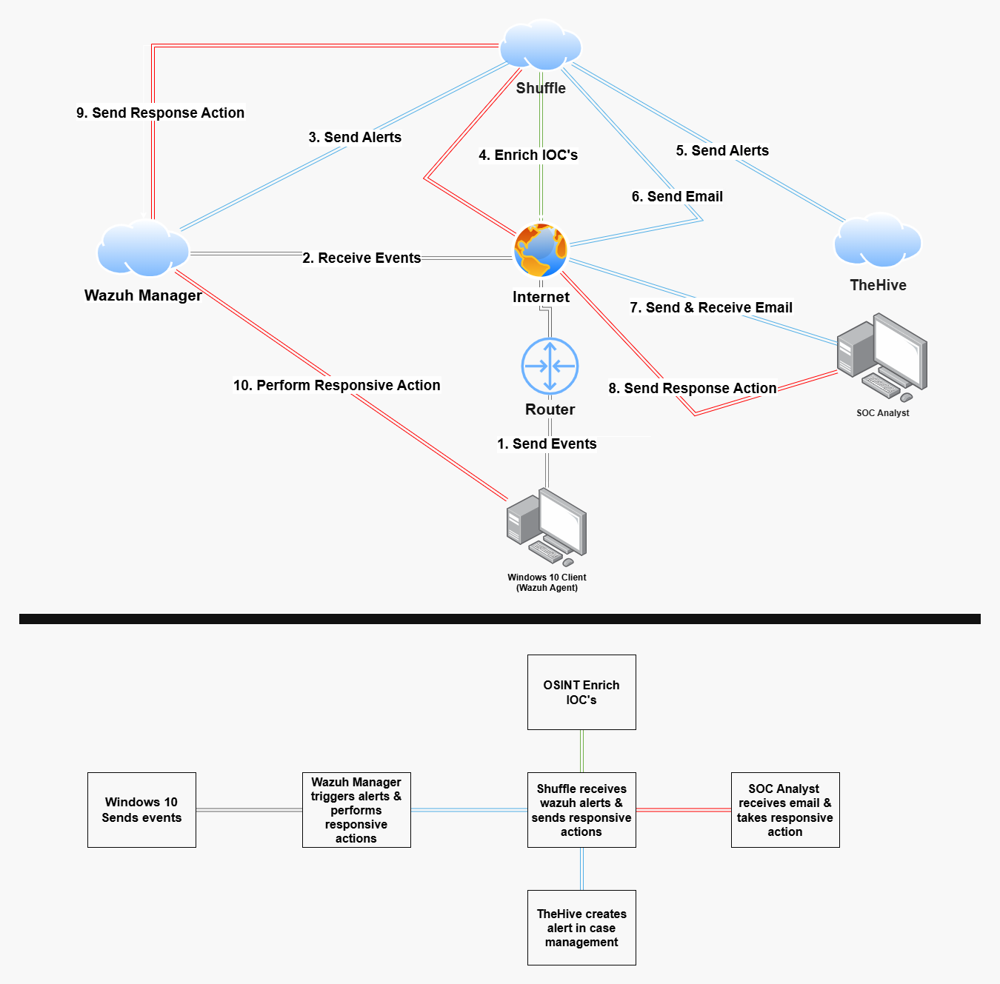

# SOC-Automation-Home-Lab

SOC Automation Home Lab based on the myDFIR SOC Automation Project.

## Overview
This repository includes the logical architecture diagram for a SOC
Automation home lab, the diagram shows the flow of the security events, alert
generation, enrichment, case management, and response actions.

## Motivation
I am a 2nd year Computer Science undergraduate majoring in Cybersecurity at
Edith Cowan University (Sri Lanka). I started this project to learn and
to better understand how Security Operations Centers (SOC) operate in the real world.

## SOC Logical Diagram

  

## Status
🚧 Work is in progress. Additional components and documentation will be added later on.
